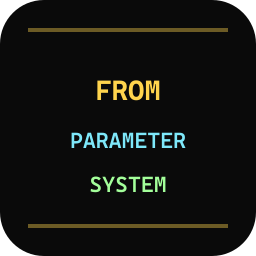

<div align="center">



# Modelfile Syntax — VSCode tooling for Ollama Modelfiles

**The complete language-tooling experience for [Ollama](https://ollama.com) Modelfiles, in every VSCode-family editor.**

[](https://marketplace.visualstudio.com/items?itemName=ahnafnafee.modelfile-syntax)
[](https://open-vsx.org/extension/ahnafnafee/modelfile-syntax)
[](https://github.com/ahnafnafee/modelfile-syntax/actions/workflows/ci.yml)
[](LICENSE)

</div>

> **What this is, in one sentence:** Open any Modelfile in VSCode, VSCodium, Cursor, Windsurf, vscode.dev, or github.dev and get syntax coloring for every Ollama instruction, real-time linting for 18 classes of mistake, hover documentation on every PARAMETER, autocomplete for instructions / parameters / template variables, and 26+ snippets for common patterns — all offline, all in pure TypeScript, no network calls.

<!-- Demo GIF placeholder -->

---

## Table of Contents

- [Features](#features)
- [Install](#install)
- [Quick start](#quick-start)
- [Modelfile reference](#modelfile-reference) — canonical instruction + PARAMETER tables
- [Linter rules](#linter-rules) — OM001 through OM018
- [Snippets](#snippets)
- [Configuration](#configuration)
- [FAQ](#faq)
- [Comparison vs. other extensions](#comparison-vs-other-extensions)
- [Roadmap](#roadmap)
- [Contributing](#contributing)
- [About the author](#about-the-author)
- [License](#license)
- [Acknowledgments](#acknowledgments)

---

## Features

- **TextMate-grade syntax highlighting** for every Ollama Modelfile instruction: `FROM`, `PARAMETER`, `TEMPLATE`, `SYSTEM`, `ADAPTER`, `LICENSE`, `MESSAGE`, `REQUIRES`, `RENDERER`, `PARSER`, `DRAFT`.
- **Real-time linter** with **18 diagnostic rules** — catches unknown PARAMETER names, type mismatches, missing/duplicate `FROM`, invalid MESSAGE roles, deprecated parameters, single-quote truncation, default-context-window foot-guns, unterminated triple-quoted strings, and more.
- **Hover documentation** for every instruction and every PARAMETER — type, default, valid range, and a one-line description, sourced from the canonical Ollama spec.
- **Autocomplete** for instruction keywords, PARAMETER names, MESSAGE roles, and Go template variables (`.System`, `.Prompt`, `.Messages`, `.Tools`, `.Response`).
- **26+ snippets** for common patterns: Llama 3 / Qwen 2.5 / ChatML / Phi-3 chat templates, RAG-grounded system prompts, coder personas, full-file starters.
- **Embedded Go template highlighting** inside `TEMPLATE """..."""` bodies — keywords (`if`, `range`, `end`), variables (`.System`, `.Messages`), and pipes are colorized.
- **Works in the browser** — vscode.dev and github.dev support out of the box. No `child_process`, no `fs` — pure-JS bundle.
- **Cross-editor compatible** — published to both the Visual Studio Marketplace _and_ the Open VSX Registry, so it works in VSCode, VSCodium, Cursor, Windsurf, Gitpod, and GitHub Codespaces.
- **No telemetry. No network calls. No surprises.**

---

## Install

| Editor                      | Where to install from                                                                                        | Install command                                          |
| --------------------------- | ------------------------------------------------------------------------------------------------------------ | -------------------------------------------------------- |
| **VSCode**                  | [Visual Studio Marketplace](https://marketplace.visualstudio.com/items?itemName=ahnafnafee.modelfile-syntax) | `code --install-extension ahnafnafee.modelfile-syntax`   |
| **Cursor**                  | Visual Studio Marketplace (same as VSCode)                                                                   | `cursor --install-extension ahnafnafee.modelfile-syntax` |
| **Windsurf**                | Visual Studio Marketplace                                                                                    | search "Ollama Modelfile" in the Extensions panel        |
| **VSCodium**                | [Open VSX Registry](https://open-vsx.org/extension/ahnafnafee/modelfile-syntax)                              | `codium --install-extension ahnafnafee.modelfile-syntax` |
| **Gitpod / Codespaces**     | Open VSX Registry                                                                                            | search "Ollama Modelfile"                                |
| **vscode.dev / github.dev** | Visual Studio Marketplace                                                                                    | install from the Extensions panel                        |

The extension activates automatically for files named `Modelfile`, `Modelfile.*`, or any file with the `.modelfile` extension.

---

## Quick start

Create a file named `Modelfile` in your project. You'll get instant syntax coloring and real-time validation. Try:

```modelfile
FROM llama3.2

PARAMETER temperature 0.7
PARAMETER num_ctx 8192

SYSTEM """You are a concise senior engineer. Answer in 1–3 sentences."""
```

Hover over `temperature` → see its type, default, and recommended range. Type `PARAMETER ` → autocomplete every valid parameter name. Make a typo like `PARAMETER bogus 1` → see the red squiggle (`OM005`).

Or use a snippet: type `modelfile-chat` and press <kbd>Tab</kbd> to scaffold a complete conversational Modelfile.

---

## Modelfile reference

The tables below are the canonical, machine-readable reference codified inside the extension's linter. They are cross-validated against [`github.com/ollama/ollama/parser`](https://github.com/ollama/ollama/tree/main/parser), [docs.ollama.com/modelfile](https://docs.ollama.com/modelfile), and [ollama.readthedocs.io](https://ollama.readthedocs.io/en/modelfile/).

### Instructions

All instructions are **case-insensitive**. `FROM` is required and **must be the first non-comment instruction** in the file.

| Instruction | Required | Repeatable       | Multi-line body | Purpose                                                                               |
| ----------- | -------- | ---------------- | --------------- | ------------------------------------------------------------------------------------- |
| `FROM`      | yes      | no (exactly one) | no              | Declares the base model (name, tag, GGUF path, or HF reference).                      |
| `PARAMETER` | no       | yes              | no              | Sets one runtime or runner parameter. Repeat for multiple.                            |
| `TEMPLATE`  | no       | no               | yes (`"""`)     | Defines the prompt template in Go template syntax.                                    |
| `SYSTEM`    | no       | no               | yes (`"""`)     | Sets the default system message.                                                      |
| `ADAPTER`   | no       | no               | no              | Applies a LoRA/QLoRA adapter (`.gguf` only).                                          |
| `LICENSE`   | no       | yes              | yes (`"""`)     | Declares the model's legal license.                                                   |
| `MESSAGE`   | no       | yes              | yes (`"""`)     | Pre-loads a conversation message.                                                     |
| `REQUIRES`  | no       | no               | no              | Minimum Ollama version (semver).                                                      |
| `RENDERER`  | no       | no               | no              | Custom prompt renderer.                                                               |
| `PARSER`    | no       | no               | no              | Custom output parser.                                                                 |
| `DRAFT`     | no       | no               | no              | Speculative-decoding draft model (**experimental** — requires `--experimental` flag). |

### PARAMETER catalog

| Name                | Type   | Default | Range        | Description                                                 |
| ------------------- | ------ | ------- | ------------ | ----------------------------------------------------------- |
| `num_ctx`           | int    | 2048    | ≥ 1          | Context window size in tokens.                              |
| `num_batch`         | int    | 512     | ≥ 1          | Token batch size.                                           |
| `num_gpu`           | int    | -1      | ≥ -1         | GPUs to use (-1 = auto, 0 = CPU only, 999 = all available). |
| `main_gpu`          | int    | 0       | ≥ 0          | Primary GPU index.                                          |
| `num_thread`        | int    | 0       | ≥ 0          | CPU threads (0 = runtime decides).                          |
| `num_keep`          | int    | 4       | ≥ 0          | Tokens to retain after context truncation.                  |
| `use_mmap`          | bool   | —       | true / false | Memory-map model weights.                                   |
| `num_predict`       | int    | -1      | ≥ -2         | Max tokens to generate (-1 = unlimited, -2 = fill context). |
| `seed`              | int    | 0       | any int      | Random seed for reproducibility.                            |
| `temperature`       | float  | 0.8     | ≥ 0          | Sampling temperature. Higher = more creative.               |
| `top_k`             | int    | 40      | ≥ 0          | Top-K sampling (0 = disabled).                              |
| `top_p`             | float  | 0.9     | 0 – 1        | Nucleus sampling threshold.                                 |
| `min_p`             | float  | 0.0     | 0 – 1        | Minimum token probability vs. most-likely.                  |
| `typical_p`         | float  | 1.0     | 0 – 1        | Typical-weighted sampling.                                  |
| `tfs_z`             | float  | 1.0     | ≥ 1          | Tail-free sampling cutoff.                                  |
| `repeat_last_n`     | int    | 64      | ≥ -1         | Look-back window for repeat penalty (-1 = num_ctx).         |
| `repeat_penalty`    | float  | 1.1     | ≥ 0          | Repetition penalty strength.                                |
| `presence_penalty`  | float  | 0.0     | any          | Presence penalty.                                           |
| `frequency_penalty` | float  | 0.0     | any          | Frequency penalty.                                          |
| `mirostat`          | int    | 0       | 0 / 1 / 2    | Mirostat sampling mode.                                     |
| `mirostat_eta`      | float  | 0.1     | ≥ 0          | Mirostat learning rate.                                     |
| `mirostat_tau`      | float  | 5.0     | ≥ 0          | Mirostat target entropy.                                    |
| `stop`              | string | —       | —            | Stop sequence (repeat the PARAMETER line for multiple).     |

**Deprecated parameters** (the linter emits `OM010` warnings): `penalize_newline`, `low_vram`, `f16_kv`, `logits_all`, `vocab_only`, `use_mlock`, `num_gqa`.

### MESSAGE roles

Exactly three: `system`, `user`, `assistant`. Anything else triggers `OM008`.

### TEMPLATE variables

Available inside `{{ ... }}` expressions in any `TEMPLATE` body:

| Variable    | Type   | Where it's used                                              |
| ----------- | ------ | ------------------------------------------------------------ |
| `.System`   | string | The system message.                                          |
| `.Prompt`   | string | The current user prompt.                                     |
| `.Messages` | array  | Full conversation history (each has `.Role` and `.Content`). |
| `.Response` | string | The model's response (omitted during generation).            |
| `.Tools`    | array  | Available tools, for tool-calling models.                    |

### FROM argument forms

```modelfile
FROM llama3.2                                       # bare model name
FROM llama3.2:8b                                    # tagged
FROM llama3.2:7b-instruct-q4_K_M                    # tagged with quantization
FROM registry.ollama.ai/library/llama3:latest       # registry path
FROM hf.co/Qwen/Qwen2.5-7B-Instruct-GGUF            # HuggingFace
FROM ./qwen2.5-7b-instruct-q4_k_m.gguf              # relative GGUF
FROM /opt/models/llama.gguf                         # absolute path
FROM ~/models/qwen.gguf                             # home-relative
FROM ./qwen2.5-7b-instruct/                         # safetensors directory
```

---

## Linter rules

Every rule has a stable ID, severity, and an actionable message. Disable any rule via the [`modelfileSyntax.lint.disabledRules`](#configuration) setting.

| ID                             | Severity | What it catches                                                                               |
| ------------------------------ | -------- | --------------------------------------------------------------------------------------------- |
| [`OM001`](docs/rules.md#om001) | error    | Missing `FROM` instruction.                                                                   |
| [`OM002`](docs/rules.md#om002) | error    | `FROM` is not the first non-comment instruction.                                              |
| [`OM003`](docs/rules.md#om003) | error    | Multiple `FROM` instructions.                                                                 |
| [`OM004`](docs/rules.md#om004) | error    | Unknown instruction keyword.                                                                  |
| [`OM005`](docs/rules.md#om005) | error    | Unknown `PARAMETER` name.                                                                     |
| [`OM006`](docs/rules.md#om006) | error    | `PARAMETER` value does not match the expected type.                                           |
| [`OM007`](docs/rules.md#om007) | warning  | `PARAMETER` value outside the recommended range.                                              |
| [`OM008`](docs/rules.md#om008) | error    | Invalid `MESSAGE` role (must be `system` / `user` / `assistant`).                             |
| [`OM009`](docs/rules.md#om009) | error    | `REQUIRES` value is not valid semver.                                                         |
| [`OM010`](docs/rules.md#om010) | warning  | Deprecated `PARAMETER`.                                                                       |
| [`OM011`](docs/rules.md#om011) | warning  | Unterminated single double-quote (single `"` truncates at newline; use `"""` for multi-line). |
| [`OM012`](docs/rules.md#om012) | warning  | `num_ctx 2048` is the legacy default — most modern models support more.                       |
| [`OM013`](docs/rules.md#om013) | info     | `DRAFT` requires the `--experimental` flag at `ollama create` time.                           |
| [`OM014`](docs/rules.md#om014) | warning  | `ADAPTER` got a `.safetensors` / `.bin` / `.pt` file; expects `.gguf`.                        |
| [`OM015`](docs/rules.md#om015) | warning  | More than 6 `stop` sequences risks early termination on incidental matches.                   |
| [`OM016`](docs/rules.md#om016) | error    | Unterminated triple-quoted string.                                                            |
| [`OM017`](docs/rules.md#om017) | warning  | Long `MESSAGE system` content reads like a `SYSTEM` prompt.                                   |
| [`OM018`](docs/rules.md#om018) | info     | `TEMPLATE` references a variable outside the standard set.                                    |

Full rule explanations with before/after examples: [`docs/rules.md`](docs/rules.md).

---

## Snippets

Type the prefix and press <kbd>Tab</kbd>.

| Prefix                                                  | Inserts                                            |
| ------------------------------------------------------- | -------------------------------------------------- |
| `from`                                                  | `FROM <model>` with a model dropdown               |
| `from-tag`                                              | `FROM <model>:<tag>`                               |
| `from-gguf`                                             | `FROM ./<file>.gguf`                               |
| `from-hf`                                               | `FROM hf.co/<org>/<repo>-GGUF`                     |
| `param-temp`                                            | `PARAMETER temperature ...`                        |
| `param-ctx`                                             | `PARAMETER num_ctx ...` with context-size dropdown |
| `param-top-p` / `param-top-k` / `param-min-p`           | sampling params                                    |
| `param-rep` / `param-seed` / `param-stop` / `param-gpu` | repetition, seed, stop, GPU                        |
| `sys` / `sys-multi`                                     | single or multi-line `SYSTEM`                      |
| `sys-coder` / `sys-rag`                                 | system prompts for coding / RAG                    |
| `template-llama3`                                       | Llama 3 chat template + stop sequences             |
| `template-qwen`                                         | Qwen 2.5 ChatML template + stop sequences          |
| `template-chatml`                                       | generic ChatML                                     |
| `template-phi3`                                         | Phi-3 chat template                                |
| `message-trio` / `msg-user` / `msg-asst` / `msg-system` | MESSAGE patterns                                   |
| `adapter` / `requires` / `license`                      | one-liner instructions                             |
| `modelfile-chat`                                        | full chat Modelfile starter                        |
| `modelfile-coder`                                       | full coder Modelfile starter                       |
| `modelfile-rag`                                         | full RAG Modelfile starter                         |
| `header`                                                | comment header with name / author / purpose        |

---

## Configuration

Open VSCode settings (<kbd>Ctrl</kbd>/<kbd>Cmd</kbd>+<kbd>,</kbd>) and search "Ollama Modelfile":

| Setting                                         | Type     | Default | Description                                                |
| ----------------------------------------------- | -------- | ------- | ---------------------------------------------------------- |
| `modelfileSyntax.lint.enabled`                  | boolean  | `true`  | Enable real-time validation.                               |
| `modelfileSyntax.lint.disabledRules`            | string[] | `[]`    | Rule IDs to skip — e.g., `["OM012", "OM015"]`.             |
| `modelfileSyntax.lint.warnOnDefaultContextSize` | boolean  | `true`  | Emit `OM012` when `num_ctx` is at the 2048 legacy default. |

---

## FAQ

### What is an Ollama Modelfile?

A Modelfile is a small declarative file (similar in spirit to a Dockerfile) that tells the [Ollama](https://ollama.com) runtime how to assemble a custom local LLM: which base model to use, what system prompt to apply, what sampling parameters to set, what conversation history to pre-load, and how to format prompts via Go templates. You build a Modelfile, then run `ollama create my-model -f Modelfile` to register it.

### How do I create a custom Ollama model?

1. Install this extension.
2. Create a file named `Modelfile` (no extension).
3. Type `modelfile-chat` and press <kbd>Tab</kbd> to scaffold a starter, or copy the [Quick start](#quick-start) example.
4. From the terminal, run `ollama create my-model -f Modelfile`.
5. Chat with it: `ollama run my-model`.

### Why is my SYSTEM prompt showing as truncated?

Most likely you wrote `SYSTEM "first line\nsecond line"` (single double-quotes). Ollama treats the single `"..."` form as one line — anything after the first newline is dropped. **Use triple quotes for multi-line content:** `SYSTEM """first line\nsecond line"""`. The linter catches this as `OM011`.

### Does this extension work in VSCodium / Cursor / Windsurf?

Yes. It is published to **both** the Visual Studio Marketplace (used by VSCode, Cursor, Windsurf, vscode.dev) **and** the Open VSX Registry (used by VSCodium, Gitpod, Codespaces). See [Install](#install) for editor-specific commands.

### Does it require a network connection?

No. The grammar, linter, hover docs, completions, and snippets all run locally in the extension host. There are no telemetry calls, no remote model lookups, no analytics.

### Can I disable individual linter rules?

Yes. Set `modelfileSyntax.lint.disabledRules` to an array of rule IDs in your VSCode settings. For example, to silence the default-context-size warning and the too-many-stops warning:

```json
"modelfileSyntax.lint.disabledRules": ["OM012", "OM015"]
```

### Does this run `ollama` to validate?

No. All validation is static — the extension never invokes the `ollama` CLI. This means it works offline, in vscode.dev, and on machines that don't have Ollama installed. **Side effect:** the extension can't catch errors that only show up at `ollama create` time (e.g., a malformed adapter file). For full semantic validation, run `ollama create --dry-run`.

### How does this compare to other extensions?

See [Comparison](#comparison-vs-other-extensions).

### Where do I report a bug or suggest a feature?

[GitHub Issues](https://github.com/ahnafnafee/modelfile-syntax/issues). Bug reports should include the Modelfile snippet that reproduces the issue, the editor, and the extension version.

### Is there a Neovim / Emacs / Helix version?

Not yet. The TextMate grammar can be reused in any editor that supports TextMate grammars (LunarVim, Helix). LSP-mode support is on the roadmap for v0.3 — until then, syntax-only highlighting is straightforward to wire up by referencing `syntaxes/modelfile.tmLanguage.json` from this repo.

---

## Comparison vs. other extensions

|                                               | **modelfile-syntax** | Generic dotenv extensions | Plain-text fallback |
| --------------------------------------------- | -------------------- | ------------------------- | ------------------- |
| Syntax coloring for `FROM`, `PARAMETER`, etc. | ✅                   | partial                   | ❌                  |
| Triple-quoted `"""..."""` body handling       | ✅                   | ❌                        | ❌                  |
| Embedded Go template highlighting             | ✅                   | ❌                        | ❌                  |
| Real-time linter (18 rules)                   | ✅                   | ❌                        | ❌                  |
| Hover docs on every PARAMETER                 | ✅                   | ❌                        | ❌                  |
| Autocomplete                                  | ✅                   | ❌                        | ❌                  |
| Snippets                                      | ✅ (26+)             | ❌                        | ❌                  |
| Works in vscode.dev                           | ✅                   | depends                   | n/a                 |
| Open VSX availability                         | ✅                   | depends                   | n/a                 |

---

## Roadmap

- **v0.1** — this release: grammar, 18 linter rules, hover, completion, snippets.
- **v0.2** — Markdown / Jinja injection grammars inside `SYSTEM` / `TEMPLATE` bodies for richer formatting.
- **v0.3** — Language Server Protocol mode for Neovim / Helix / Emacs.
- **v0.4** — Optional `ollama create --dry-run` integration for true semantic validation.

Track progress on the [project board](https://github.com/ahnafnafee/modelfile-syntax/projects).

---

## Contributing

Issues and PRs welcome. See [CONTRIBUTING.md](CONTRIBUTING.md) for the local dev loop, the grammar-snapshot-test workflow, and the linter-rule contribution checklist.

```bash
git clone https://github.com/ahnafnafee/modelfile-syntax
cd modelfile-syntax
npm install
npm run build:grammar
npm run build
npm test
npm run test:grammar
npm run package   # produces modelfile-syntax-X.Y.Z.vsix
```

Open the folder in VSCode and press <kbd>F5</kbd> to launch an Extension Development Host with the extension under test.

---

## About the author

Built by **Ahnaf An Nafee** — [ahnafnafee.dev](https://www.ahnafnafee.dev) — [@ahnafnafee on GitHub](https://github.com/ahnafnafee).

If this extension saves you time, the kindest thing you can do is leave a Marketplace review and link to it from your blog / repo. (No sponsor button — yet.)

---

## License

[MIT](LICENSE) © [Ahnaf An Nafee](https://www.ahnafnafee.dev). Use it, fork it, redistribute it; just keep the license notice.

---

## Acknowledgments

- [Ollama](https://ollama.com) — for the runtime and the Modelfile format itself. This extension would not exist without the years of work the Ollama team put into making local LLMs practical.
- [`jeff-hykin/better-cpp-syntax`](https://github.com/jeff-hykin/better-cpp-syntax) — for setting the bar on what a serious community grammar extension looks like.
- [`nefrob/vscode-just`](https://github.com/nefrob/vscode-just) — for the YAML-source-to-JSON-grammar pattern that this extension cribs.
- The [LocalAI Master](https://localaimaster.com/blog/ollama-modelfile-guide) guide and the [Ollama docs](https://docs.ollama.com/modelfile) — for documenting the real-world Modelfile gotchas the linter now catches automatically.
